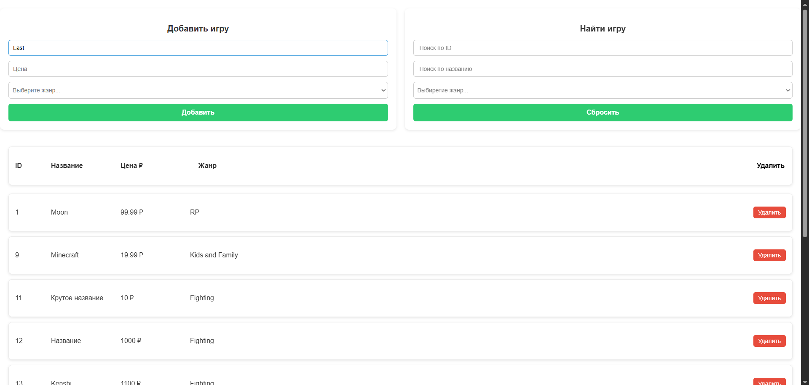

# my-game-stroe
GameStore — это веб-приложение для управления списком видеоигр, созданное как мой первый пет-проект с использованием современного стека технологий. Проект демонстрирует навыки работы с фронтендом и бэкендом, а также интеграции с базой данных. Технологии: Бэкенд: C# .NET (ASP.NET Core); Фронтенд: React; База данных: SQLite

